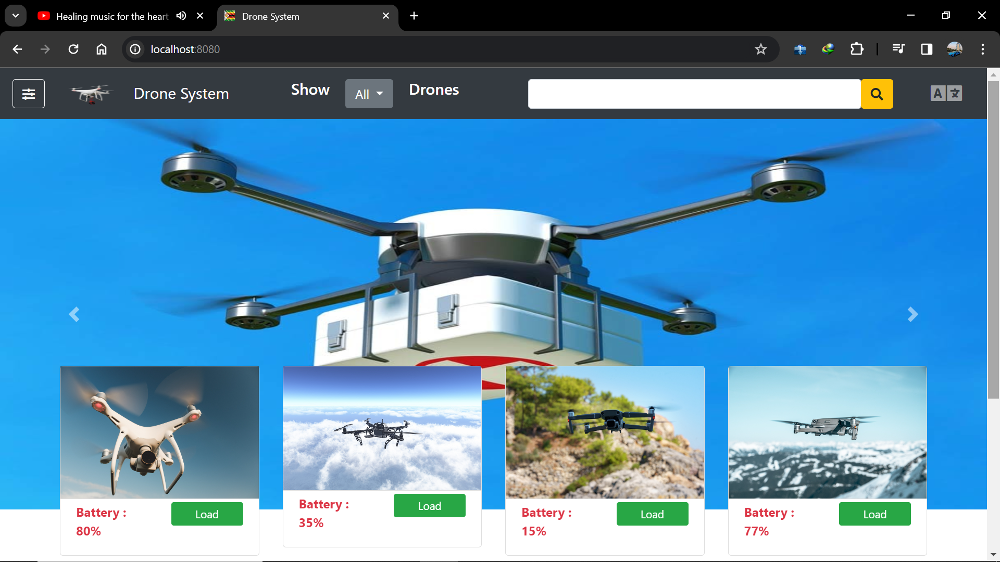
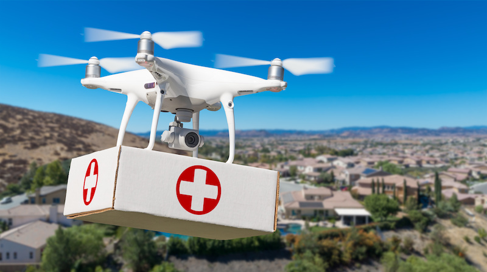

## Drones Management system

[[_TOC_]]

---

:scroll: **START**

### Pre requisites

- Java 1.8 or higher
- Maven 3.9.5 or higher
- Any IDE that supports Java and Maven (IntelliJ IDEA, Eclipse, NetBeans, etc.)
- mysql

---

### project description

This project is a springboot maven project with simple REST API for managing drones but it also has UI . It allows you to create, update, delete and list drones. It also allows you to load and unload drones with medicine .

---

### Requirements

Below are the requirements for the project
#### Functional requirements

- Prevent the drone from being loaded with more weight that it can carry;
- Prevent the drone from being in LOADING state if the battery level is **below 25%**;
- Introduce a periodic task to check drones battery levels and create history/audit event log for this;
- Introduce a periodic task to check drones location and create history/audit event log for this;

---

#### VIDEO DEMO

---

### How to run the project
 
- Clone the project from the repository
- Create a database in mysql with the name `drone`
- [optional] import the database from the file  `drone.sql` in the project under `databases` folder
- Update the `application.properties` file with your mysql username and password
- Open the project in your IDE
- Run the project using the command `mvn spring-boot:run` or run the main class `DroneApplication.java`
- Open your browser and go to `http://localhost:8080` to access the UI

---

### Importing the database : Video

### What you will learn from this project

- JPA and Hibernate for database operations
- JQUERY for making AJAX requests
- Javascript for DOM manipulation
- File upload with springboot and jquery
- Thymeleaf for server side rendering
- Bootstrap for styling

---

:scroll: **END** 
